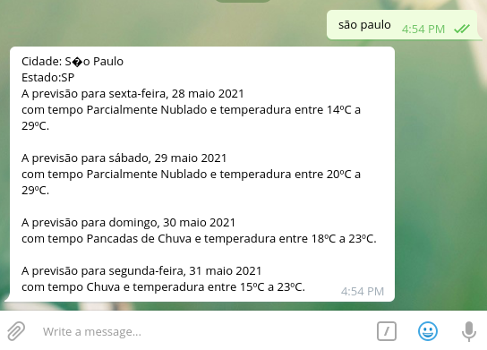

## Telegram BOT

## Ta chovendo Ai ?

A ideia é simples é apenas um Bot para telegram que informa a previsão do tempo
utilizando os dados da API do [CPTEC](https://www.cptec.inpe.br).

## Exemplo de uso

## Como executar

* Baixe o repositório: `git clone https://github.com/PedroExpedito/bot-chovendo-telegram`

* Entre na pasta: `cd bot-chovendo-telegram/BotTempo`

* Crie a variável de ambiente com o nome "BOT_TEMPO" com o valor do seu [token](https://core.telegram.org/bots/api)

* `dotnet run` Pronto.

